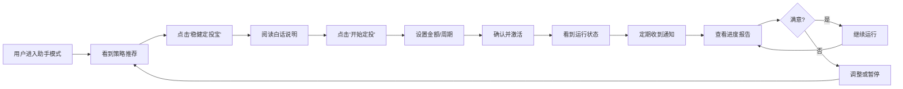

# 🎯 双模平台战略执行蓝图

## 战略核心定位

**"复杂内核，简单交互"** - 将专业能力封装为普惠服务

### 产品哲学
- **专家模式**: "我掌控一切" - 驾驶舱，飞行员视角
- **助手模式**: "帮我达成目标" - 中控台，乘客视角
- **统一原则**: **渐进式透明** - 随时可查看引擎运作原理

---

## 🏗️ 三大支柱架构

### 支柱一：双模核心功能模块

| 模块 | 专家模式 | 助手模式 | 实施状态 |
|------|----------|----------|----------|
| **策略配置** | 代码编辑器、参数优化器 | 场景策略包（"子女教育金"） | ✅ 已实现 |
| **市场分析** | K线图、研究报告、龙虎榜 | 白话解读（"市场情绪：谨慎乐观"） | ⏳ 进行中 |
| **交易执行** | 条件单、算法交易 | 智能订单（"开始定投"） | ⏳ 待实现 |
| **风险管理** | VaR、压力测试、希腊字母 | 可视化卡片（"像坐公交车一样平稳"） | ⏳ 待实现 |
| **账户视图** | 损益分析、夏普比率 | 目标进度条（"完成度47%"） | ⏳ 待实现 |

### 支柱二：意图理解层（核心大脑）

**功能**: 将用户目标翻译为可执行策略

```
用户输入: "为三年后买房攒首付"
    ↓
意图理解层分析:
  - 目标: 资本积累
  - 期限: 3年（中期）
  - 风险: 中低（有明确用途）
    ↓
输出策略:
  - 沪深300指数增强定投
  - 月投5000元
  - 预计达标概率78%
  - 风险控制：最大回撤<15%
```

**当前状态**: ✅ 已实现基础版本（5个策略包）

### 支柱三：白话解读引擎

**功能**: 专业数据 → 通俗结论

```
输入: RSI=72, 布林带上轨突破
    ↓
白话解读引擎:
    ↓
输出: "当前短期涨得有点急，不宜追高，可等待回调"
```

**当前状态**: ✅ 已实现静态模板，⏳ 待升级为AI驱动

---

## 🚀 三阶段实施路线图

### 第一阶段：内核强化与MVP验证（1-2个月）✅ 当前阶段

#### 已完成
- ✅ LEAN引擎集成（3个回测引擎可用）
- ✅ 意图理解层（5个策略包，目标翻译）
- ✅ 助手API（6个端点）
- ✅ 助手界面基础（AssistantDashboard）

#### 本阶段关键产品输出（本周完成）

**MVP场景**: "稳健定投宝"完整闭环



**需要实现的功能**:
1. ✅ 策略包展示页
2. ✅ 策略详情页
3. ⏳ 策略激活流程（含金额/周期设置）
4. ⏳ 运行状态监控
5. ⏳ 简单进度报告
6. ⏳ 通知推送集成

### 第二阶段：模式完善与体验打磨（3-5个月）

#### 目标
- 丰富助手模式策略库（5个→15个）
- 实现模式间平滑切换
- 上线"策略商店"与"目标规划器"

#### 关键产品输出
1. **策略商店**
   - 策略分类（稳健型、成长型、防守型）
   - 用户评分与评论
   - 策略性能排行榜

2. **目标规划器**
   - 用户输入：买房、退休、子女教育
   - 系统输出：资金规划建议 + 策略推荐

3. **模式切换机制**
   - 助手模式任意页面可"查看技术参数"
   - 专家模式可"封装为策略包"

### 第三阶段：自动化与生态扩展（6-12个月）

#### 目标
- 深化全自动交易
- 拓展产品边界（开发者平台、社交跟单）

#### 关键产品输出
1. **全自动巡航模式**
   - AI监控市场机会
   - 自动执行交易
   - 异常情况人工介入

2. **策略开发者平台**
   - 专家创建策略
   - 策略审核机制
   - 收益分成模式

3. **社交跟单功能**
   - 关注优秀投资者
   - 一键复制公开组合
   - 跟单透明度监控

---

## 🎯 第一阶段核心任务清单

### 本周优先级（Priority 0）

#### 1. 完善策略激活流程
**文件**: `frontend/src/pages/StrategyActivationFlow.tsx`

**流程设计**:
```
策略卡片 → [激活按钮]
    ↓
激活向导（3步）:
  Step 1: 确认策略信息
    - 策略名称、风险等级、预期收益
    - 白话说明和类比
  
  Step 2: 设置参数
    - 投资金额（默认5000，可调整）
    - 定投周期（每周/每月）
    - 自动执行开关
  
  Step 3: 确认并启动
    - 参数汇总
    - 风险提示（需勾选确认）
    - [启动策略]按钮
    ↓
跳转到运行状态页
```

#### 2. 实现运行状态监控
**文件**: `frontend/src/pages/StrategyRunningStatus.tsx`

**界面设计**:
```
┌─────────────────────────────────────────┐
│ 🛡️ 稳健增长定投宝                      │
│ 运行中 · 已运行15天                     │
├─────────────────────────────────────────┤
│ 📊 当前表现                              │
│  投入金额: ¥5,000                       │
│  当前价值: ¥5,234 (+4.68%)             │
│  累计收益: +¥234                        │
│                                         │
│ 📈 历史表现图表                          │
│  [简化的权益曲线]                       │
│                                         │
│ 📅 下次操作                              │
│  预计2025-12-14买入 ¥1,000             │
│  原因: 市场RSI低于30，触发买入信号      │
│                                         │
│ ⚙️ 操作                                 │
│  [暂停策略] [调整参数] [查看详情]       │
└─────────────────────────────────────────┘
```

#### 3. 简单进度报告
**文件**: `frontend/src/components/SimpleProgressReport.tsx`

**报告内容**:
```
本周总结（2025-12-01 至 2025-12-07）

✅ 执行情况
  - 本周执行1次定投，买入¥1,000
  - 当前持仓: 沪深300 ETF 100份
  
📊 收益情况
  - 本周收益: +¥45 (+0.9%)
  - 累计收益: +¥234 (+4.68%)
  - 年化收益率: 约12.5%（预测）
  
🎯 目标进度
  - 目标金额: ¥100,000（3年后）
  - 当前进度: 5.2%
  - 预计达成: 2028年12月（准时）
  
💡 下周建议
  - 继续保持当前策略
  - 市场情绪平稳，无需调整
```

---

## 📋 技术实现细节

### 新增API端点需求

#### 1. 策略激活接口增强
```python
POST /api/v1/assistant/strategies/activate/setup

# 请求
{
  "package_id": "stable_growth_low_risk",
  "investment_amount": 5000,
  "frequency": "weekly",  # weekly/monthly
  "auto_execute": true
}

# 响应
{
  "strategy_instance_id": "inst_20251207_001",
  "status": "activated",
  "next_execution": "2025-12-14",
  "estimated_first_trade": {
    "action": "buy",
    "amount": 1000,
    "reason": "首次建仓"
  }
}
```

#### 2. 运行状态查询
```python
GET /api/v1/assistant/strategies/running/{instance_id}

# 响应
{
  "instance_id": "inst_20251207_001",
  "package_name": "稳健增长定投宝",
  "status": "running",
  "days_active": 15,
  "performance": {
    "invested": 5000,
    "current_value": 5234,
    "profit": 234,
    "profit_rate": 4.68
  },
  "next_action": {
    "date": "2025-12-14",
    "type": "buy",
    "amount": 1000,
    "reason": "RSI低于30，触发买入"
  }
}
```

#### 3. 简单报告生成
```python
GET /api/v1/assistant/strategies/report/{instance_id}?period=weekly

# 响应
{
  "period": "2025-12-01 to 2025-12-07",
  "summary": {
    "executions": 1,
    "weekly_profit": 45,
    "weekly_profit_rate": 0.9,
    "total_profit": 234,
    "total_profit_rate": 4.68
  },
  "goal_progress": {
    "target_amount": 100000,
    "current_progress": 5.2,
    "on_track": true
  },
  "next_week_advice": "继续保持当前策略，市场情绪平稳"
}
```

---

## 🎨 设计原则落地

### 1. 白话解读示例库

**专业术语** → **白话翻译**

| 专业说法 | 白话说法 |
|---------|---------|
| RSI超买（>70） | 涨得有点急，可能要歇一歇 |
| RSI超卖（<30） | 跌得有点狠，可能要反弹了 |
| MACD金叉 | 短期趋势开始向上，可以关注 |
| 布林带收窄 | 价格波动变小，可能要有大动作 |
| 夏普比率1.5 | 每承担1份风险，获得1.5份收益（不错） |
| 最大回撤-15% | 历史上最糟糕时亏过15%（但后来涨回来了） |

### 2. 风险等级可视化

```
风险评分1: 🟢🟢🟢🟢⚪ 极低风险 - 像存银行
风险评分2: 🟢🟢🟢⚪⚪ 低风险 - 像货币基金
风险评分3: 🟡🟡🟡⚪⚪ 中风险 - 像股票基金
风险评分4: 🟠🟠🟠🟠⚪ 中高风险 - 像成长股
风险评分5: 🔴🔴🔴🔴🔴 高风险 - 像创业投资
```

### 3. 进度可视化

```
目标进度条:
━━━━━━━━━━━━━━━━━━━━━━━━━━━━━━━━━━━━━━━━
█████████░░░░░░░░░░░░░░░░░░░░░░░░░ 25%

时间进度条:
━━━━━━━━━━━━━━━━━━━━━━━━━━━━━━━━━━━━━━━━
█████████████░░░░░░░░░░░░░░░░░░░░░ 33%

结论: 投资进度落后于时间进度，需适当加大投入
```

---

## 💡 关键决策点

### 1. MVP场景选择：为何是"稳健定投宝"？

**原因**:
1. **用户基数大**: 稳健型投资者占80%
2. **理解门槛低**: 定投概念普及度高
3. **风险可控**: 低风险适合首次尝试
4. **效果可验证**: 短期即可看到定投执行

### 2. 白话引擎实现策略

**阶段1（当前）**: 规则模板
- 预定义专业术语→白话映射表
- 基于阈值的条件判断

**阶段2（3个月后）**: GPT增强
- 接入GPT-4 API
- 动态生成白话解读
- 考虑用户历史反馈优化

**阶段3（6个月后）**: 自有模型
- 训练专用金融白话模型
- 降低API成本
- 提高响应速度

### 3. 数据存储策略

**新增表结构**:

```sql
-- 策略实例表
CREATE TABLE strategy_instances (
    id VARCHAR(50) PRIMARY KEY,
    user_id INT,
    package_id VARCHAR(50),
    status VARCHAR(20),
    investment_amount DECIMAL(10,2),
    frequency VARCHAR(10),
    auto_execute BOOLEAN,
    activated_at TIMESTAMP,
    last_execution_at TIMESTAMP,
    next_execution_at TIMESTAMP
);

-- 执行历史表
CREATE TABLE execution_history (
    id BIGINT AUTO_INCREMENT PRIMARY KEY,
    instance_id VARCHAR(50),
    execution_date TIMESTAMP,
    action VARCHAR(10),  -- buy/sell/hold
    amount DECIMAL(10,2),
    price DECIMAL(10,4),
    reason TEXT,
    status VARCHAR(20)
);

-- 简单报告表
CREATE TABLE simple_reports (
    id BIGINT AUTO_INCREMENT PRIMARY KEY,
    instance_id VARCHAR(50),
    report_period VARCHAR(20),
    start_date DATE,
    end_date DATE,
    summary JSON,
    advice TEXT,
    created_at TIMESTAMP
);
```

---

## 📊 成功指标定义

### 第一阶段MVP指标

**核心指标**:
1. **激活完成率**: 进入激活流程 → 完成激活 ≥ 60%
2. **7日留存率**: 激活后7天仍活跃 ≥ 40%
3. **用户满意度**: NPS评分 ≥ 8分

**辅助指标**:
1. 平均激活时长 < 3分钟
2. 策略暂停率 < 20%
3. 从助手切换到专家的比例 > 5%（证明渐进式透明有效）

**定性指标**:
1. 用户反馈："我终于知道该怎么投资了"
2. 用户反馈："操作很简单，不懂金融也能用"
3. 用户反馈："看到进度条很有成就感"

---

## 🚀 本周执行计划

### Day 1-2: 策略激活流程（当前优先级最高）
- 创建 `StrategyActivationFlow.tsx`
- 实现3步向导UI
- 对接激活API

### Day 3-4: 运行状态监控
- 创建 `StrategyRunningStatus.tsx`
- 实现权益曲线图表
- 对接状态查询API

### Day 5: 简单进度报告
- 创建 `SimpleProgressReport.tsx`
- 实现报告生成逻辑
- 集成通知推送

### Day 6-7: 测试与优化
- 端到端流程测试
- 用户体验优化
- 文档完善

---

## 📚 相关文档

- **技术实现**: `DUAL_MODE_ARCHITECTURE.md`
- **功能演示**: `DUAL_MODE_DEMO_GUIDE.md`
- **API设计**: `backend/api/endpoints/assistant_api.py`
- **前端组件**: `frontend/src/pages/AssistantDashboard.tsx`

---

**最后更新**: 2025年12月7日  
**当前阶段**: 第一阶段 - MVP验证  
**下一里程碑**: 完成"稳健定投宝"完整闭环（7天内）

---

## 💬 核心理念提醒

> "在每一个开发决策前，都问一句：**一个完全不懂金融的人，能理解并放心使用这个功能吗？**"

这是我们的北极星指标。所有功能设计、文案撰写、交互流程，都必须通过这个检验。
